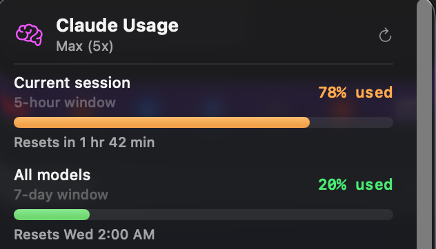

# Claude Usage Widget

A macOS menu bar app that displays your Claude Code usage limits and session stats at a glance.



## Features

- **Rate limits**: 5-hour and 7-day usage percentages with progress bars and reset countdowns
- **Active sessions**: All running Claude Code sessions with model, project path, API equivalent cost, and lines changed
- **Today / This Week**: Message, session, and token counts
- **Recent Activity**: 14-day activity bar chart
- **Model breakdown**: All-time token usage per model (Opus, Sonnet, Haiku)
- **Recent sessions**: Last 5 sessions with first prompt preview
- **Auto-refresh**: Updates every 5 seconds from live session data

## Requirements

- macOS 14+ (Sonoma or later)
- Swift 6.0+
- [Claude Code](https://claude.ai/code) CLI installed and authenticated

## How it works

The app reads data from two sources:

1. **Live rate limits**: A `statusLine` hook in Claude Code settings writes session data (including rate limits) to `~/.claude/session-status/` as JSON files. The app reads these every 5 seconds.
2. **Historical stats**: `~/.claude/stats-cache.json` and `~/.claude/usage-data/session-meta/` provide historical usage data (daily activity, model breakdown, past sessions).

## Installation

### 1. Configure the statusline hook

Add the statusline script that persists rate limit data:

```bash
# Create the script
cat > ~/.claude/statusline.sh << 'EOF'
#!/bin/bash
input=$(cat)
mkdir -p ~/.claude/session-status
session_id=$(echo "$input" | /usr/bin/python3 -c "import sys,json; print(json.load(sys.stdin).get('session_id','unknown'))" 2>/dev/null)
echo "$input" > ~/.claude/session-status/${session_id}.json
echo "$input" > ~/.claude/rate-limits.json
EOF
chmod +x ~/.claude/statusline.sh
```

Then add the `statusLine` setting to `~/.claude/settings.json`:

```json
{
  "statusLine": {
    "type": "command",
    "command": "bash ~/.claude/statusline.sh"
  }
}
```

If you already have other settings in the file, just add the `statusLine` key alongside them.

### 2. Build the app

```bash
git clone https://github.com/sudomakeit25/claude-usage-widget.git
cd claude-usage-widget
bash Scripts/build.sh
```

This compiles a release build and creates `build/ClaudeUsage.app`.

### 3. Install

```bash
# Install to user Applications folder
cp -r build/ClaudeUsage.app ~/Applications/

# Or install system-wide (requires sudo)
sudo cp -r build/ClauseUsage.app /Applications/
```

### 4. Launch

```bash
open ~/Applications/ClaudeUsage.app
```

A brain icon will appear in your menu bar. Click it to see your usage dashboard.

### 5. (Optional) Start on login

Go to **System Settings > General > Login Items**, click **+**, and select **ClaudeUsage** from your Applications folder.

## Updating

```bash
cd claude-usage-widget
git pull
bash Scripts/build.sh
pkill -x ClaudeUsage
cp -r build/ClaudeUsage.app ~/Applications/
open ~/Applications/ClaudeUsage.app
```

## What the metrics mean

| Metric | Description |
|--------|-------------|
| **Current session (5-hour)** | Usage percentage of your 5-hour rolling rate limit window |
| **All models (7-day)** | Usage percentage of your 7-day rolling rate limit window |
| **API equiv.** | What the session's token usage would cost at standard API pricing. On Max/Pro plans, this is informational only, not an actual charge. |
| **ctx %** | How much of the model's context window is currently used |
| **+lines / -lines** | Lines of code added/removed in the session |

## Project structure

```
claude-usage-widget/
  Package.swift                          # Swift Package Manager config
  Sources/ClaudeUsage/
    App.swift                            # Menu bar app entry point
    Models.swift                         # Data models for all JSON sources
    UsageDataService.swift               # File reading, parsing, auto-refresh
    MenuBarView.swift                    # SwiftUI views and components
  Scripts/
    build.sh                             # Build script (compile + create .app bundle)
```

## Troubleshooting

**All metrics show 0**: The `stats-cache.json` may be stale. Start a Claude Code session; the live session data will populate the Today section.

**No rate limits shown**: Make sure the `statusLine` hook is configured in `~/.claude/settings.json` and you have an active Claude Code session running.

**App doesn't appear in menu bar**: Check that you're on macOS 14+. Try running the binary directly: `./build/ClaudeUsage.app/Contents/MacOS/ClaudeUsage`

## License

MIT
